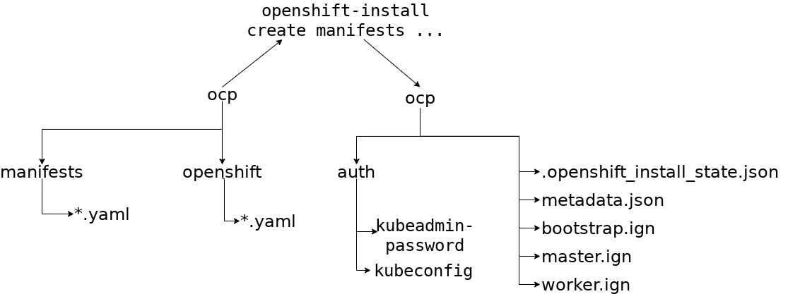

# Установка REDHAT openshift в ALTCOS

## Реализация

- Установка в среду PVE или LIBVIRT QEMU
- При установке развернуть для два диска - / (ext4)  и /var (btrfs). 
  Описание см [Creating a separate /var partition](https://docs.openshift.com/container-platform/4.9/installing/installing_platform_agnostic/installing-platform-agnostic.html#installation-user-infra-machines-advanced_vardisk_installing-platform-agnostic)


## Настройка DNS

Определение прямой зоны для поддоменов
- api.osp4;
- *.apps.osp4;
- bootstrap.ocp4;
- master0.osp4;
- master1.osp4;
- master2.osp4;
- worker0.osp4;
- worker1.osp4.
```
$TTL 14400
altlinux.io.   IN      SOA   ns1.altlinux.io. root.altlinux.io. (
        2022022201      ; Serial
        10800           ; Refresh
        3600            ; Retry
        604800          ; Expire
        604800          ; Negative Cache TTL
);
                        IN      NS      ns1
@                       IN      A       10.150.0.5
ns1                     IN      A       10.150.0.5
quay                    IN      CNAME ns1       

api.osp4 IN  A 10.150.0.200
*.apps.osp4 IN CNAME api.osp4

bootstrap.ocp4 IN  A 10.150.0.201
master0.osp4   IN       A 10.150.0.202
master1.osp4   IN       A 10.150.0.203
master2.osp4   IN       A 10.150.0.204

worker0.osp4   IN  A 10.150.0.205
worker1.osp4   IN  A 10.150.0.206
```

Определение обратной зоны для поддоменов
```
$TTL 3600
@   IN      SOA   ns1.altlinux.io. root.altlinux.io. (
              2022022202       ; Serial
              21600             ; refresh
              3600              ; retry
              3600000           ; expire
              86400 )           ; minimum
 
   IN      NS      ns1.altlinux.io.


; $ORIGIN 0.150.10.in-addr.arpa.

200.0.150.10.in-addr.arpa. IN PTR api.ocp4.altlinux.io.
200.0.150.10.in-addr.arpa. IN PTR api-int.ocp4.altlinux.io.

201.0.150.10.in-addr.arpa. IN PTR bootstrap.ocp4.altlinux.io.
202.0.150.10.in-addr.arpa. IN PTR master0.ocp4.altlinux.io.
203.0.150.10.in-addr.arpa. IN PTR master1.ocp4.altlinux.io.
204.0.150.10.in-addr.arpa. IN PTR master2.ocp4.altlinux.io.

205.0.150.10.in-addr.arpa. IN PTR worker0.ocp4.altlinux.io.
206.0.150.10.in-addr.arpa. IN PTR worker1.ocp4.altlinux.io.
```

## Настройка балансировщика нагрузки

```
# /etc/haproxy/haproxy.cfg
#---------------------------------------------------------------------
# Global settings
#---------------------------------------------------------------------
global
    log /dev/log local0
    log /dev/log local1 notice
    daemon

#---------------------------------------------------------------------
# common defaults that all the 'listen' and 'backend' sections will
# use if not designated in their block
#---------------------------------------------------------------------
defaults
    mode                    http
    log                     global
    option                  httplog
    option                  dontlognull
    option http-server-close
    option forwardfor       except 127.0.0.0/8
    option                  redispatch
    retries                 1
    timeout http-request    10s
    timeout queue           20s
    timeout connect         5s
    timeout client          20s
    timeout server          20s
    timeout http-keep-alive 10s
    timeout check           100s

frontend stats
  bind *:1936
  log global
  maxconn global
  stats enable
  stats hide-version
  stats refresh 30s
  stats show-node
  stats show-desc Stats for ocp4 cluster
  stats auth admin:ocp4
  stats uri /stats
listen api-server-6443
  bind *:6443
  mode tcp
  server bootstrap.ocp4.altlinux.io:6443 check inter ls backup
  server master0 master0.ocp4.altlinux.io:6443 check inter 1s
  #server master1 master1.ocp4.altlinux.io:6443 check inter 1s
  #server master2 master2.ocp4.altlinux.io:6443 check inter 1s
listen machine-config-server-22623
  bind *:22623
  mode tcp
  server bootstrap.ocp4.altlinux.io:22623 check inter ls backup
  server master0 master0.ocp4.altlinux.io:22623 check inter 1s
  #server master1 master1.ocp4.altlinux.io:22623 check inter 1s
  #server master2 master2.ocp4.altlinux.io:22623 check inter 1s
listen ingress-router-443
  bind *:443
  mode tcp
  balance source
  server worker0 worker0.ocp4.altlinux.io:443 check inter ls 1s
  #server worker1 worker1.ocp4.altlinux.io:443 check inter ls 1s
listen ingress-router-80
  bind *:80
  mode tcp
  balance source
  server worker0 worker0.ocp4.altlinux.io:443 check inter ls 1s
  #server worker1 worker1.ocp4.altlinux.io:443 check inter ls 1s
```


## Генерация SSH-ключей

## Установка дополнительного ПО 

## Установка openshift

### Создание ignition-файлов

#### Создание файла конфигурации install-config.yaml

```

```

#### Генерация файлов манифестов

```
# mkdir ocp
# cp install-config.yaml ocp
INFO Consuming Install Config from target directory 
WARNING Making control-plane schedulable by setting MastersSchedulable to true for Scheduler cluster settings 
INFO Manifests created in: ocp/manifests and ocp/openshift
```


##### Добавление манифестов (создание BTRFS томов)

#### Создание ignition-файлов

```
# ./openshift-install create ignition-configs --dir ocp
INFO Consuming Worker Machines from target directory 
INFO Consuming Common Manifests from target directory 
INFO Consuming OpenShift Install (Manifests) from target directory 
INFO Consuming Openshift Manifests from target directory 
INFO Consuming Master Machines from target directory 
INFO Ignition-Configs created in: ocp and ocp/auth 
```



## Ссылки

- [Running Openshift at Home - Part 4/4 Deploying Openshift 4 on Proxmox VE ](https://blog.rossbrigoli.com/2020/11/running-openshift-at-home-part-44.html)
- [Install OpenShift on any x86_64 platform with user-provisioned infrastructure](https://console.redhat.com/openshift/install/platform-agnostic)
- [Installing a cluster on any platform](https://docs.openshift.com/container-platform/4.9/installing/installing_platform_agnostic/installing-platform-agnostic.html)
- 
