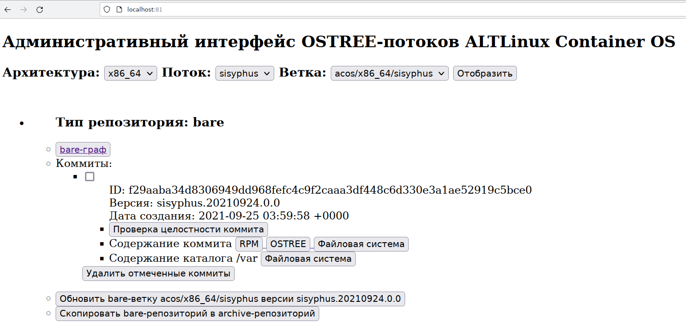

# Установка и настрока WEB-серверов для административного и клиентского WEB/REST интерфейсов

Для работы с ostree-репозиториями и образами ACOS поддерживаются два интерфейса:
- административный интерфейс на порту 81;
- клиентский интерфейс на порту 80;

Административный интерфейс предназначен для создания, обновления версий веток и подветок потоков:
- доступен только в рамках подсети Базальт;
- работает с корнем данного репозитория (начальная страница /index.php), 
- пользователь apache2 под которым работает сайт входит в группу wheel, позволяющей выполнять shell скрипты с правами root;
- все каталоги подкаталога данных ACOS доступны на чтение-запись.

Клиентский интерфейс преднаначен для предоставлении информации клиенту, скачивания образов и обровлений из архивного ostree-репозитория:
- доступен из Интернета;
- корневым директорием является подкаталог данных /ACOS, вышележащие каталоги с скрипты недоступны;
- пользователь apache2 под которым работает сайт имеет стандартные права;
- корневой каталог /ACOS монтируется ТОЛЬКО НА ЧТЕНИЕ (RO);

Оба интерфейса запускаются в виде docker-сервисов через docker-compose.

## Сборка docker-образа getacos клиентского интерфейса
Сборка производится в каталоге [/docker/getacos](https://github.com/alt-cloud/getacos/tree/feature-acosfile/docker/getacos).


### [Dockerfile](https://github.com/alt-cloud/getacos/blob/feature-acosfile/docker/getacos/Dockerfile).

Сборка идет от docker-образа `alt:sisyphus`. В образ устанавливается основные пакеты для работы:
```
apache2 apache2-mod_ssl 
apache2-mod_php7 php7-curl php7-mbstring php7  
ostree 
rsync 
vim-console 
less
```

### Стартовый скрипт [startApache.sh](https://github.com/alt-cloud/getacos/blob/feature-acosfile/docker/getacos/startApache.sh)

Для того, чтобы данные в каталоге данных `ACOS` в административном и клиентском  интерфейсе 
были доступны под одним и тем же URL `/ACOS/...` в подкаталоге `/ACOS/` для клиенского сервера создается сиволическая ссылка 
ACOS на корневой директорий  `ACOS -> .`.

Затем запускается apache2-сервер.

### Скрипт сборки образа [build.sh](https://github.com/alt-cloud/getacos/blob/feature-acosfile/docker/getacos/build.sh)

Скрипт предназначен для сборки docker-образа `getacos`.


## Сборка docker-образа admingetacos административного интерфейса
Сборка производится в каталоге [/docker/admingetacos](https://github.com/alt-cloud/getacos/tree/feature-acosfile/docker/admingetacos).


### [Dockerfile](https://github.com/alt-cloud/getacos/blob/feature-acosfile/docker/admingetacos/Dockerfile).

Для уменьшение суммарного объема образов на диске и в оперативной памяти
сборка образа `admingetacos` идет от docker-образа `getacos`, описанного выше. 
В этом случае в образе `admingetacos` наследуются основные слои образа `getacos`.

В образе:
- дополнительно устанавливаются пакеты `sudo, su` для обеспечения доступа к правам root;
- пользователь `apache2` добавляется к группе `wheel`;
- правится файл `/etc/sudoers` для беспарольного доступа к правам `root`;
- для повышения уровня защиты поднимается виртуальный хост под доменами `admingetacos.altlinux.org`, `builds.acos.altlinux.org`.

### Стартовый скрипт [startApache.sh](https://github.com/alt-cloud/getacos/blob/feature-acosfile/docker/admingetacos/startApache.sh)

Перед запуском сервера создается (если отсутствует) корневой каталог потока `acos/x86_64/sisyphus`.   

### Скрипт сборки образа [build.sh](https://github.com/alt-cloud/getacos/blob/feature-acosfile/docker/admingetacos/build.sh)

Скрипт предназначен для сборки docker-образа `admingetacos`.


## Запуск сервисов

Запуск сервисов производится в каталоге [/docker/](https://github.com/alt-cloud/getacos/tree/feature-acosfile/docker).

### Файл установки переменных [.env](https://github.com/alt-cloud/getacos/blob/feature-acosfile/docker/.env)

Каталог где установлен текущий git-репозиторий [getacos](https://github.com/alt-cloud/getacos/tree/feature-acosfile)
на локальном сервере указыватся в файле [.env](https://github.com/alt-cloud/getacos/blob/feature-acosfile/docker/.env).

### Файл описания сервисов [docker-compose.yml](https://github.com/alt-cloud/getacos/blob/feature-acosfile/docker/docker-compose.yml)

Сервисы описываются в YML-файле [docker-compose.yml](https://github.com/alt-cloud/getacos/blob/feature-acosfile/docker/docker-compose.yml).

- сервис `getacos`:
  * пользовательский WEB-сервис привязывается к порту `80`.
  * корневой директорий сайта привязывается к поддиректирию данных [/ACOS/](https://github.com/alt-cloud/getacos/tree/feature-acosfile/ACOS).

- сервис `admingetacos`:
  * административный WEB-сервис привязывается к порту `81`.
  * повышаются приведегии процессов для поддерки оверлейного (`overlay`) монтирования каталогов;
  * корневой директорий сайта привязывается к корневому каталога git-репозитория [/](https://github.com/alt-cloud/getacos/tree/feature-acosfile). 

### Скрипт запуска сервисов [start-compose.sh](https://github.com/alt-cloud/getacos/blob/feature-acosfile/docker/start-compose.sh)

Скрипт (пере)запускает сервисы стека.

### Скрипт запуска сервисов [stop-compose.sh](https://github.com/alt-cloud/getacos/blob/feature-acosfile/docker/stop-compose.sh)

Скрипт останавливает сервисы стека.


## Порядок сборки образов и запуска сервисов

1. Убедитесь, что установлены пакеты `docker-engine`, `docker-compose` и запущен сервис `docker`.
Если нет, устаовите их:
```
# apt-get install docker-engine docker-compose
# systemctl enable docker
# systemctl start docker
```

2. Перейдите в каталог `/docker/getcos/` и запустите скрипт `build.sh` сборки образа `getacos`:
```
# cd .../getacos/docker/getcos/
# ./build.sh
...
Successfully built ....
Successfully tagged getacos:latest
```

3. Перейдите в каталог `/docker/admingetcos/` и запустите скрипт `build.sh` сборки образа `getacos`:
```
# cd .../getacos/docker/admingetcos/
# ./build.sh
...
Successfully built ....
Successfully tagged admingetacos:latest
```

4. Укажите файле `/docker/.env`  каталог git-директория данного репозитория на локальном компьютере.  

5. Перейдите в каталог `/docker/` и запустите скрипт `start-compose.sh`:
```
# cd ../getacos/docker/
# ./start-compose.sh
Creating network "docker_default" with the default driver
Creating docker_getacos_1      ... done
Creating docker_admingetacos_1 ... done
```


## Работа с интерфейсом

Установите в каталог, где находится поддиректорий данного репозитория репозиторий 
mkimage-profiles@keremet:
```
$ git clone http://git.altlinux.org/people/keremet/packages/mkimage-profiles.git -b acos
```

Перейдите в терминальном режиме в каталог [/ostree/shell/](https://github.com/alt-cloud/getacos/tree/release_0.0.1/ostree/shell) и запустите команду
```
$ ./mkimage-profiles.sh sisyphus
...
23:23:52 initializing BUILDDIR: build/
23:23:52 preparing distro config: build/distcfg.mk
23:24:39 starting image build: tail -f build/build.log
23:28:57 done (4:17)
** image: .../getacos/ACOS/streams/acos/x86_64/sisyphus/mkimage-profiles/acos-20210924-x86_64.tar [1,1G]
23:28:57 cleaning up after build
```
В результате рабоьы команды в директории `/ACOS/streams/acos/x86_64/sisyphus/mkimage-profiles/`
появиься файлы  `acos-<YYYYMMDD>-x86_64.tar*` с символическими ссылками:
```
-rw-r--r-- 1 kaf kaf 1073920000 сен 24 23:28 acos-20210924-x86_64.tar
-rw-r--r-- 1 kaf kaf       3895 сен 24 23:24 acos-20210924-x86_64.tar.cfg
-rw-r--r-- 1 kaf kaf     281331 сен 24 23:28 acos-20210924-x86_64.tar.log
lrwxrwxrwx 1 kaf kaf         24 сен 24 23:28 acos-latest-x86_64.tar -> acos-20210924-x86_64.tar
lrwxrwxrwx 1 kaf kaf         22 сен 24 23:28 mkimage-profiles.tar -> acos-latest-x86_64.tar
```

В браузере наберите URL: `http://localhost:81/`. Отобразится начальный интерфейс:


Кликните по клавише `Создать ветку acos/x86_64/sisyphus`.
В отдельной вкладке откроется интерфейс в котором через несколько десяток секунд
появится результат выполнения команды:
```
/var/www/vhosts/getacos/ostree/bin/rootfs_to_repo.sh acos/x86_64/sisyphus
...
```

Вернитесь на вкладку административного интерфейса и перегрузите страницу `<ALT><Shift>R`:


Покликайте по кнопкам созданной версии соммита. В отдельной вкладке будут отображаться результаты выполнения команд.

