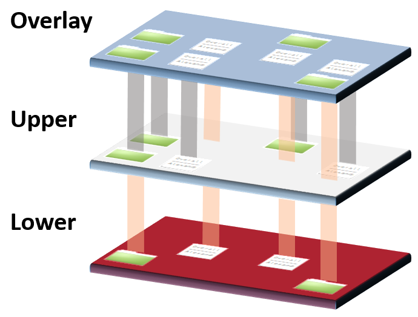

# Режимы работы с репозиторием - обновление, добавление, удаление пакетов

Работа с репозиторием в основном сводится к следующим основным режимам:
- обновление текущего репозитория (`apt-get update; apt-get dist-upgrade`);
- формирование нового репозитория пуьем добавления или ужаления пакетов
  (`apt-get install ...;`, `apt-get remove ...` );
- "ручной" корректировке, добавлению или удалению файлов.

Во всех случаях процесс состоит из следующих стадий:
1. формирование дерево файловой системы из репозитория (`ostree chechout ...` или `ostree deploy ...`)
2. корректировка созданного дерева;
3. формирование на основе скорректированного дерева новой ветки репозитория (`ostree commit ...`).

Так как эти действия (установку или удаления новых пакетов с созданием новой ветки) будет производит пользователь по REST-запросу, необходимо максимально уменьшить время выполнения этих операций. 

Первый  этап - разворачивание дерева (`ostree checkout`) производится достаточно быстро - доли секунды (создаются лищь каталоги и жесткие ссылки на существующие файлы).  

Время выполнения второго этапа технологически изменить невозможно.

Основное время занимает третий этапm так как там для каждого элемента дерева заново пересчитываются контрольная суммы для формироывания имени файлв в каталоге `objects` репозитория.
Чтобы ускорить выполнение этого этапа `ostree commit ...` поддерживает флаг `--link-checkout-speedup`. В этом случае, если 
`inode` файла или каталога репозитория совпадает с `inode` развернутого и скорректированного дерева, то пересчет контрольной суммы не производится. Пересчитываются контрольные суммы только вновь созданных или откоректированных каталогов и файлов.

Таким образом необходимо на втором этапе при корректировке файла исключить возможность его корректировки "на месте" без изменения `inode`. 

Для решения этой проблемы в `ostree` [предлагается использовать](https://ostreedev.github.io/ostree/buildsystem-and-repos/) модуль `rofiles-fuse` разрабатываемый в рамках `ostree`.

Проведенные работы показали, что использовать его достаточно проблематично - файлы монтируются `только на чтение` и корректировка их на втором этапе невозможна.

Для решения этой проблемы были рассмотрены два решения:
- использования `docker build ...`, `docker run`;
- использование монтирования каталогов в режиме `overlay`. 

## Использования `docker build ...`, `docker run`

В этом варианте на основе развернутого каталога (`root`) строится образ из Dockerfile:
```
FROM scratch
COPY /root /
RUN apt-get update; apt-get dist-upgrade
```
командой:
```
docker buils -t <имя_образа>:<ветка_ostree> .
``` 

При построении образа копия основного каталог `root` монтируется в виде отдельного слоя (`layer`) в режиме `только на чтение`.
Все изменения производятся в отдельном слое с созданием новых `inode` как для новых, так и для корректируемых файлов.

После построения образа командой `docker inspect ...` определяется тропа до созданного слоя изменений и созданные изменения копируютcя с новыми `inode`  в каталог `root`.

Достоинства метода:
- решается проблема корректировки файла 'на месте' без изменения `inode`;
- для каждой ветки репозитория создается docker-образ, ктторый в дальнейшем можно использовать при тестировании ПО.

Недостатки:
- занимается дополнительное дисковое пространство для хранения слоев docker-образов.
- создание образа производится достаточно долго, так как при построении образа каталог `root` передается docker-демону и затем полностью разворачивается (использование `podman` уменьшает время, но оно остается досточно большим - около минуты)

## Использование монтирования каталогов в режиме `overlay`

В этом варианте кроме каталога `root` создаются дополнительеы пустые каталоги `upper`, `work`, `merged` и производится оверлейное монтирование этих каталогов на каталог `root`:
```
mount -t overlay overlay -o lowerdir=./root,upperdir=./upper,workdir=./work ./merged;
``` 

Каталог `root` монтируется как нижний слой в режиме `только на чтение`.
Основная работа производится в каталоге `merged`.
Все изменения, произвееденные в каталоге `merged` сохраняются в каталоге `upper` с новыми `inode`.

После проведения изменений они переносятся из каталога `upper` в каталог `root` с новыми `inode`.



Удаленные файлы и каталоги в каталоге `upper` отображаются в виде специальных файлов типа `c` (`character devices`). Перед копированием каталога `upper` файлы с аналогичным именем удаляются из каталога `root` и каталога `upper`.

Достоинства метода:
- обеспечивает быстрый перенос и удаление только новых файлов
- не занимает дополнительное дисковое пространство, так как все измененниы файлы в итоге перемещаются в каталог `root` с неизменными `inode`, что кстати увеличивает скорость переноса файлов - создаются только ссылки на ф айлы без переноса их содержимого

Недостатки:
- не создаюися docker-образы. Тестировать решене можно только путем развачивания (`ostree checkout`, `ostree deploy`) веток репозитория.

В итоге для реализации механизма изменения веток был выбран этот вариант.
