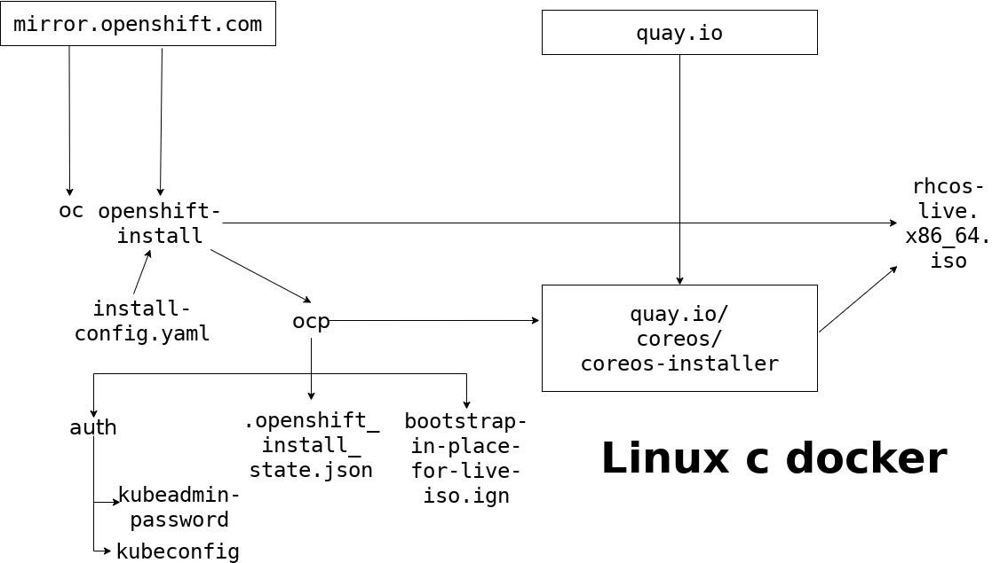

# Описание установки REDHAT openshift в режиме одного узла (SingleNode)

## Начальные действия

### Подготовка live ISO-образа 



Установка возможна на любой ОС Linux. поддерживаюшей `docker`.

Перед установкой необходимо 
- Скачать бинарный код клиента Openshift `oc`:
 ```
 curl -k https://mirror.openshift.com/pub/openshift-v4/clients/ocp/latest/openshift-client-linux.tar.gz > oc.tar.gz
 tar zxf oc.tar.gz
 chmod +x oc
 ```
 
 - Определиться с версией `OpenShift`
   ```
   OCP_VERSION=<ocp_version> 
   ```
    Список версий можно посмотреть на сайте https://mirror.openshift.com/pub/openshift-v4/x86_64/clients/ocp/.
    
- Скачать устанощик `openshift-install`
  ```
  curl -k https://mirror.openshift.com/pub/openshift-v4/clients/ocp/$OCP_VERSION/openshift-install-linux.tar.gz > openshift-install-linux.tar.gz
  tar zxvf openshift-install-linux.tar.gz
  chmod +x openshift-install
  ```
- Определить URL ISO-файла и скачать его
  ```
  ISO_URL=$(./openshift-install coreos print-stream-json | grep location | grep x86_64 | grep iso | cut -d\" -f4)
  curl $ISO_URL > rhcos-live.x86_64.iso
  ```  
- Подготовить `install-config.yaml`:
  Пример файла:
  ```
  apiVersion: v1
  baseDomain: openshift.altlinux.io
  compute:
  - name: worker
    replicas: 0
  controlPlane:
    name: master
    replicas: 1
  metadata:
    name: openshift
  networking:
    networkType: OVNKubernetes
    clusterNetwork:
    - cidr: 10.244.0.0/16
      hostPrefix: 24
    serviceNetwork:
    - 10.96.0.0/16
  platform:
    none: {}
  BootstrapInPlace:
    InstallationDisk: /dev/vda
  pullSecret: ...
  sshKey: |
    ssh-rsa ...
  ```
    * `pullSecret` нужно скачать под Вашим эккаунтом со страницы `https://console.redhat.com/openshift/install/pull-secret`
    * `sshKey` копируется из файла `~/.ssh/id_rsa.pub`.
- Скопировать файл `install-config.yaml` в каталог `ocp` и создать ignition-файл `ocp/bootstrap-in-place-for-live-iso.ign`:
  ```
  mkdir ocp
  cp install-config.yaml ocp
  ./openshift-install --dir=ocp create single-node-ignition-config
  ```
- Скачать образ `quay.io/coreos/coreos-installer:release`:
  ```
  sudo podman pull quay.io/coreos/coreos-installer:release
  ```
- Включить полученный ignition-файл в ISO-образ:
  ```
  cp ocp/bootstrap-in-place-for-live-iso.ign iso.ign
  sudo podman run --privileged --rm -v /dev:/dev -v /run/udev:/run/udev -v $PWD:/data -w /data \
    quay.io/coreos/coreos-installer:release \
    iso ignition embed -fi iso.ign rhcos-live.x86_64.iso
  ```
### Настройка DNS

Выберите корневое доменное имя (например `altlinux.io`) и сформируйте для него DNS-записи типа A:
```
openshift.openshift IN A 192.168.122.135
api.openshift.openshift IN CNAME openshift.openshift
*.apps.openshift.openshift IN CNAME openshift.openshift
api-int.openshift.openshift IN CNAME openshift.openshift
```
и типа PTR
```
135.122.168.192.in-addr.arpa. IN PTR openshift.openshift.altlinux.io.
```
## Создание виртуальной машины в libvirt

Создайте виртуальную машину со следующими параметрами:
- ISO-образ - сформированный на предыдущих щагах ISO-образ
- имя - openshift
- размер оперативной памяти - 16384Mb
- число ядер - 6
- размер диска - 25GB

## Установка openshift

Запустите виртуальную машину.
Дождитесь появления промптера `Login` и остановите машину.
Так как IP-адрес `192.168.122.xxx` выделяется динамически прочитайте его перед промптером `Login` и настройте DNS на этот адрес.
Снимите оставнов машины и удаленно через `ssh` зайдите на машину и перейдите в суперпользователя:
```
ssh core@192.168.122.xxx
sudo bash
```

После загрузки запусукаются сервисы.
Состояние каждого сервиса записывается в файл
`/var/log/openshift/<имя_сервиса>.json`.

Порядок запуска сервисов:
- `release-image.service` (скрипт `usr/local/bin/release-image-download.sh`)
   Сервис загружает образ `quay.io/openshift-release-dev/ocp-release@sha256:...` и проверяет его соответствие 
   архитектуре процессора узла.
   Имя образа записывается в переменные `RELEASE_IMAGE` и `RELEASE_IMAGE_DIGEST`.

- `bootkube.service` (скрипт `/usr/local/bin/bootkube.sh`) запускается в каталоге `/var/opt/openshift`.
  Сервис:
  * Создает в каталоге `/etc/kubernetes/` подкаталоги `manifests`, `bootstrap-configs`, `bootstrap-manifests}`
  * Посредством вызова команды 
    ```
    podman run ... "${RELEASE_IMAGE_DIGEST}" image
    ```
    определяются образы с именем `quay.io/openshift-release-dev/ocp-v4.0-art-dev` с различнымы sha256-тегами:
    - `MACHINE_CONFIG_OPERATOR_IMAGE` - `machine-config-operator` 
    - `MACHINE_CONFIG_OSCONTENT` - machine-os-content` 
    - `MACHINE_CONFIG_ETCD_IMAGE` - `etcd` 
    - `MACHINE_CONFIG_INFRA_IMAGE` - `pod` 
    - `CLUSTER_ETCD_OPERATOR_IMAGE` - `cluster-etcd-operator`
    - `CONFIG_OPERATOR_IMAGE` - `cluster-config-operator`
    - `KUBE_APISERVER_OPERATOR_IMAGE` - `cluster-kube-apiserver-operator`
    - `KUBE_CONTROLLER_MANAGER_OPERATOR_IMAGE` - `cluster-kube-controller-manager-operator`
    - `KUBE_SCHEDULER_OPERATOR_IMAGE` - `cluster-kube-scheduler-operator`
    - `INGRESS_OPERATOR_IMAGE` - `cluster-ingress-operator`
    - `CLOUD_CREDENTIAL_OPERATOR_IMAGE` - `cloud-credential-operator`
    - `OPENSHIFT_HYPERKUBE_IMAGE` - `hyperkube`
    - `OPENSHIFT_CLUSTER_POLICY_IMAGE` - `cluster-policy-controller`
    - `CLUSTER_BOOTSTRAP_IMAGE` - `cluster-bootstrap`
    - `KEEPALIVED_IMAGE` - `keepalived-ipfailover`
    - `COREDNS_IMAGE` - `coredns`
    - `HAPROXY_IMAGE` - `haproxy-router`
    - `BAREMETAL_RUNTIMECFG_IMAGE` - `baremetal-runtimecfg`
  * Запускает стадию (`service_stage`) `openshift-manifests`, которая копирует файлы-манифесты из подкаталога 
    `openshift` в подкаталог `manifests` (если стадия уже запускалась она пропускается)
  * 


## Ссылки

- [Installing OpenShift on a single node ](https://docs.openshift.com/container-platform/4.9/installing/installing_sno/install-sno-installing-sno.html)
- [Openshift Single Node for Distributed Clouds](https://medium.com/codex/openshift-single-node-for-distributed-clouds-582f84022bd0)
